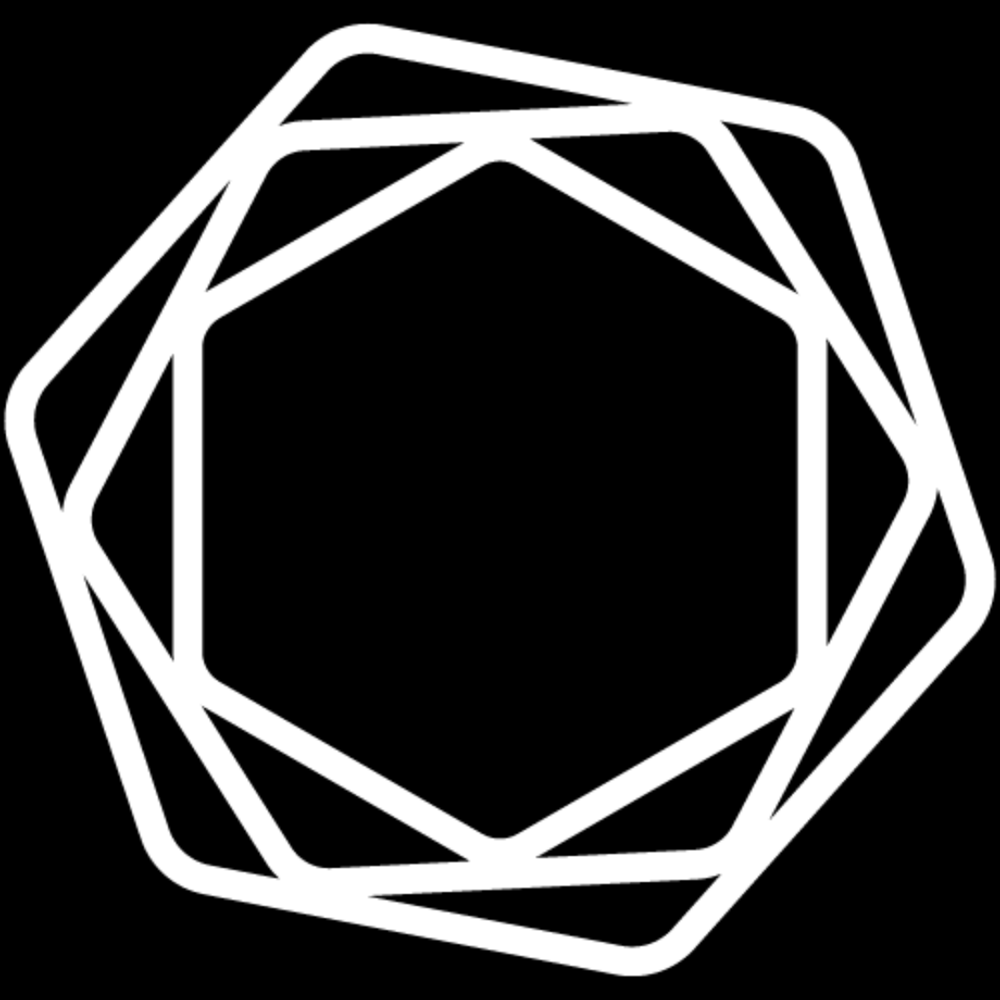

<h1 align="center">👋 Hello! I'm Keith DeSantis</h1>

    <b>Cybersecurity Developer, Administrator, and Analyst.</b>

---
<h3 align="center">I have interests in Software Development, Network Administration and Cybersecurity.</h3>

---

- 🔭 I’m currently working in **Cybersecurity and Network Defense**

- 🌱 I’m currently learning **Splunk, Security+, Web Development**

- 🎓 Check out my [Undergraduate Repository](https://github.com/KeithDeSantis/CS-Undergraduate) to see my schoolwork from my Computer Science Undergraduate Degree

- 📫 How to reach me **[keithwdesantis@gmail.com](mailto:keithwdesantis@gmail.com) | [kwdesantis@wpi.edu](mailto:kwdesantis@wpi.edu)**

- 👀 Other interests: Rowing, Video Games, Board Games, CTF, D&D, Books, Guitar, Baking
---
<h3 align="left"> Skills:</h3>

                  

---

<h3 align="center"> Here are a few of my favorite projects/works on my GitHub to check out:

* 👮‍♂️ My senior capstone project, [Warden](https://github.com/SuS-MQP/MQP), involved two friends and I designing, developing, and implementing a system to detect control flow integrity compromises in PHP web applications. Warden did so by utilizing historical execution data and lightweight data structures. Designed to work within the Single Use Server architecture developed by Professor Craig Shue and his students.

* 🔒 My Network Security Class consisted of three "Missions" where we built an infrastructure, executed an attack, and built a functioning defense of our own design based on a topic. They dealt with [Web Infrastructure Security](https://github.com/KeithDeSantis/CS-Undergraduate/blob/master/4404%20Network%20Security/Mission_1/Mission%201%20Writeup.pdf), [Multi-Factor Authentication](https://github.com/KeithDeSantis/CS-Undergraduate/blob/master/4404%20Network%20Security/Mission_2/Mission%202%20Writeup.pdf), and [Botnets and Intrusion Detection Systems](https://github.com/KeithDeSantis/CS-Undergraduate/blob/master/4404%20Network%20Security/Mission_3/Mission%203%20Writeup.pdf).

* 🤖 My work in Introduction to AI, involving projects based around [Genetic Algorithms](https://github.com/KeithDeSantis/CS-Undergraduate/blob/master/4341%20Introduction%20to%20Artificial%20Intelligence/Assignment%202/submission/Assignment2WriteUp.pdf), [Machine Learning](https://github.com/KeithDeSantis/CS-Undergraduate/blob/master/4341%20Introduction%20to%20Artificial%20Intelligence/Assignment%203/Assignment3WriteUp.pdf), [Reinforcement Learning](https://github.com/KeithDeSantis/CS-Undergraduate/blob/master/4341%20Introduction%20to%20Artificial%20Intelligence/Assignment%204/README.md), and more.

* 🏥 A [Brigham and Women's Hospital Kiosk App](https://github.com/KeithDeSantis/Brigham-And-Womens-Kiosk-App) developed by me and a team of 10 other students over the course of a term for my Software Engineering course. This was one of the largest projects I'd worked on both in codebase and size of collaborators and I was very proud of the final product.

* 🎨 A personal project, [`Picasso`](https://github.com/KeithDeSantis/PicAsso), originally developed to try to sort albums into collages based on dominant colors using AI, with built in Spotify Integration. I've since expanded on it to have to ability to recreate refernce images from a set of source images, allowing me to recreate some of my favorite album covers out of other albums I love, but it can be used for any such purpose.

* 📈 A simple simulation of the spread of disease using the [SIR model](https://github.com/KeithDeSantis/SIR-Simulator-With-Animation). This one is by far the worst code I have on my GitHub, but has a special place in my heart as it is the very first time I began programming and successfully created a project I set my mind to.

* 🎓 Finally, all the cumulative work of my Computer Science [Undergraduate Degree](https://github.com/KeithDeSantis/CS-Undergraduate.git) at Worcester Polytechnic Institute can be found in a repository, separated by class.</h3>
    
---    

<h3 align="left">Github Stats:</h3>

&nbsp;

